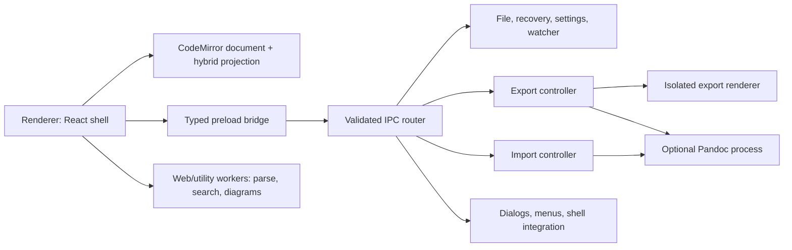

# 系统架构

## 1. 架构原则

1. Markdown 源码是唯一文档权威。
2. 编辑投影可以丢弃并重建，源码和恢复记录不可以。
3. 渲染器不可信且无系统权限。
4. 所有磁盘副作用都有冲突检查、日志和失败恢复。
5. 昂贵解析、搜索、图表和导出不得阻塞输入主线程。
6. 菜单、工具栏、快捷键和右键菜单只调用统一命令。

## 2. 进程结构



- **Main process**：应用生命周期、窗口、原生菜单、对话框、文件、watcher、恢复、设置、外部进程、导入、导出与日志。
- **Preload**：一项能力一个方法；不暴露 `ipcRenderer`、`fs`、`shell` 或通用命令执行。
- **Renderer**：React 外壳、CodeMirror、命令状态和非特权 UI。
- **Workers/utility process**：全局搜索、批量解析、Mermaid 和重型导出准备。
- **Export renderer**：只加载本地模板和净化后的文档模型，无 Node 权限。

### M0 Electron security ownership

The M0 Electron shell keeps each security boundary owned by one main-process
module:

| Boundary              | Owner                                                                                                                                                                 | Responsibility                                                                                                                                                                                                                                                                      |
| --------------------- | --------------------------------------------------------------------------------------------------------------------------------------------------------------------- | ----------------------------------------------------------------------------------------------------------------------------------------------------------------------------------------------------------------------------------------------------------------------------------- |
| App bootstrap         | `src/main/index.ts`, `src/main/bootstrap/compose-application.ts`, `src/main/bootstrap/resolve-main-window-options.ts`, and `src/main/bootstrap/create-main-window.ts` | `index.ts` adapts `app.enableSandbox()`, `app.isPackaged`, and `ELECTRON_RENDERER_URL`; composition calls the sandbox enablement before readiness; the resolver removes the development URL for packaged execution; and the factory performs the resulting `loadURL` or `loadFile`. |
| Session policy        | `src/main/security/session-security-policy.ts` and `src/main/security/content-security-policy.ts`                                                                     | Installs CSP response headers and denies permission checks and permission requests.                                                                                                                                                                                                 |
| WebContents policy    | `src/main/security/web-contents-security-policy.ts`                                                                                                                   | Synchronously denies navigation, redirects, new windows, and webview attachment.                                                                                                                                                                                                    |
| External URL policy   | `src/main/security/external-url-policy.ts`                                                                                                                            | Parses and bounds input, applies protocol, credential, and target allowlists, requests confirmation, then hands only the normalized URL to the OS.                                                                                                                                  |
| BrowserWindow factory | `src/main/bootstrap/create-main-window.ts`                                                                                                                            | Creates windows with the immutable production `webPreferences` security baseline.                                                                                                                                                                                                   |
| Preload               | `src/preload/index.ts`, `src/preload/api/create-app-api.ts`, and `create-command-api.ts`                                                                              | M0 owns the frozen typed `{ app, commands }` surface. Generic IPC and future product capabilities remain absent until their owning iteration defines and verifies a narrow contract.                                                                                                |

`src/main/index.ts` registers the WebContents policy through
`web-contents-created` before readiness, so it also applies to future windows.
That broad event coverage does not grant privileged capabilities. M0 exposes
only one narrow invoke method and strict command event/state methods. Every
later capability still requires its owning iteration's contract, authorization,
implementation, and tests.

## 3. 源码与会话模型

```ts
type Encoding = 'utf8' | 'utf8-bom' | 'utf16le' | 'utf16be'
type Eol = '\n' | '\r\n'

interface SourceBuffer {
  readonly text: string // CodeMirror 使用的规范 LF 文本
  readonly encoding: Encoding
  readonly eolByLine: readonly Eol[] // 保留每一条原始行结束符
  readonly originalBytesHash: string
}

interface DocumentSession {
  readonly id: string
  readonly path: string | null
  readonly buffer: SourceBuffer
  readonly revision: number
  readonly savedRevision: number
  readonly diskVersion: DiskVersion | null
  readonly externalState: 'clean' | 'changed' | 'deleted' | 'unknown'
}

interface DiskVersion {
  readonly mtimeMs: number
  readonly size: number
  readonly contentHash?: string
}
```

加载时解码字节并建立 `eolByLine`。CodeMirror 内部使用 LF；每个 transaction 同步更新文本和行结束符索引。序列化时按索引恢复未触及行的原始 EOL，新行使用相邻行，否则使用文档主导 EOL。未脏会话直接复用原始字节。

`DocumentSession` 是独立于 React 的领域对象。React 只订阅路径、脏状态、统计和命令状态；不得持有完整文档副本。

## 4. 编辑器投影

CodeMirror 6 同时承载源码与混合模式：

- `SourceModeExtension`：完整标记、Markdown 高亮、行号和源码命令。
- `HybridProjectionExtension`：使用 decorations 隐藏非活动标记，使用 mark decorations 呈现行内样式。
- `BlockWidgetRegistry`：表格、公式、图表、TOC、YAML 和 HTML 预览。
- `RevealController`：根据选择、组合输入、鼠标和命令决定标记显隐。
- `SourcePatchService`：块组件只能提交带预期 revision 的源码范围补丁。

块组件接口：

```ts
interface MarkdownBlockAdapter<TModel> {
  kind: string
  parse(source: string, range: SourceRange): ParseResult<TModel>
  render(model: TModel, context: RenderContext): WidgetDescriptor
  apply(operation: BlockOperation, snapshot: BlockSnapshot): SourcePatch
  validate(patch: SourcePatch, snapshot: BlockSnapshot): ValidationResult
}
```

如果 revision 或源码哈希不匹配，补丁必须拒绝并重新解析，不能覆盖并发输入。

## 5. Markdown 核心

- Lezer/CodeMirror parser 用于增量编辑、范围和高亮。
- `markdown-it` 用于安全预览和 HTML 语义输出，但绝不用于保存 Markdown。
- 功能注册表统一开关 GFM、脚注、数学、图表、上下标、高亮、Alerts 等扩展。
- 两套解析器通过同一黄金语料验证节点范围和可见语义；发现差异时以源码安全和明确产品规则处理。

## 6. 命令系统

M0 的纯 TypeScript `CommandRegistry` 位于 `src/domain/commands/`，不依赖
React、DOM、Electron 或 Node。当前 `CommandId` 仅包含
`view.toggleSidebar` 和 `app.about`；context 已包含 session/dirty/editor 维度，
但这两个基础命令不会虚构尚不存在的产品限制。

`src/shared/commands/` 是这两个命令的层无关元数据权威，集中固定 ID、label
key、快捷键、菜单分组和菜单类型；`src/shared/i18n/` 集中提供原生菜单与
renderer 共用的中英文基础命令文案。domain 定义、main 原生菜单和 renderer
快捷键适配器均从这张冻结台账派生，不再各自硬编码快捷键或标签。

registry 在构造时拒绝重复 ID，输出按 ID 排序的只读
`visible/enabled/checked` 快照，并在执行前阻止未知、不可见或禁用命令。
renderer 按钮、右键菜单和快捷键直接调用该 registry；原生菜单通过严格的
main-to-preload event 回传同一 command ID。禁止在 UI 或 main 内复制命令逻辑。

main 的应用菜单只是投影：renderer 把恰好两个批准 ID 的严格状态快照通过
现有 sender/window 验证路由同步；main 按派生的窗口 ID 保存快照，只对当前
focused 且已登记窗口应用。窗口 blur、销毁或无 focused target 时立即重新
应用失败关闭状态；无快照、发送异常同样失败关闭。

## 7. IPC 契约

- 契约位于 `src/shared/contracts/`，TypeScript 类型由 Zod schema 推导。
- renderer 请求只携带契约版本、preload 生成的 request ID 和方法 payload；窗口、WebContents 和会话上下文不能由 renderer 声明，必须由 main 从已登记窗口派生。
- 文件路径仅来自用户选择、已授权工作区或既有会话；不接受渲染器随意扩大访问范围。
- 结果使用 `Result<T, AppError>` 形状，错误包含稳定 code、可本地化 message key 和安全 details。
- 长任务支持进度、取消和超时；取消必须终止子进程或 worker。

### M0 implemented IPC flow

```text
renderer window.lattice.app.getInfo()
→ frozen preload method
→ fixed lattice:app:get-info channel
→ preload request ID + main-derived window identity
→ 65,536-character / depth-8 / 256-entry budget + Zod request
→ injected AppInfo handler
→ Zod Result + JSON-like serializability validation
→ preload response schema and request-ID correlation
→ renderer
```

M0 derives `windowId` and `webContentsId` from the application-owned
registry. Its `sessionId` is explicitly `null`; no renderer-controlled window
or session context crosses the boundary. The current handler returns only
contract version 1 application name, version, and `win32 | darwin | linux`
platform metadata. File, workspace, settings, import, and export capabilities
belong to their owning iterations and are not callable in M0.

### M0 command projection flow

```text
renderer CommandRegistry state
→ frozen commands.updateStates(states)
→ fixed lattice:commands:update-states route
→ existing value budget + sender/window + Zod validation
→ main menu snapshot for the derived window only

native menu click
→ current authorized focused window
→ lattice:commands:invoked with a strict approved ID
→ preload event validation
→ renderer CommandRegistry.execute(id, context)
```

`commands.onInvoke()` returns an idempotent unsubscribe. Invalid event payloads
and renderer listener exceptions are contained without exposing the Electron
event or raw payload. Buttons, renderer context menu, and shortcuts never cross
IPC; they call the same registry directly.

## 8. 工作区与搜索

- `WorkspaceService` 维护根路径、授权范围、树快照、排序和忽略规则。
- `FileWatcher` 合并短时间重复事件，通过 stat/hash 区分自身保存与外部修改。
- 全局搜索使用打包的 ripgrep sidecar；参数数组传给 `spawn`，`shell:false`。
- 未保存的活动文档在 renderer 内单独搜索并与磁盘结果去重。

## 9. 渲染、导入与导出

`RenderDocument` 是只读的语义模型，只服务预览、复制和导出，不回写 Markdown。导出流程：会话快照 → 解析 → 净化资源 → 主题 → 等待字体/公式/图表稳定 → HTML/PDF/图片输出。

PDF 使用 Electron `webContents.printToPDF`。Pandoc 通过适配器接收临时 Markdown/JSON AST 与受控参数；绝不拼接 shell 命令。导出模板和用户附加内容在隔离渲染器中运行。

Pandoc 导入是独立的只读源转换：用户授权源文件 → 复制到受控临时目录或以参数数组传入 → Pandoc 输出 UTF-8 Markdown 与资源目录 → 校验大小、编码、路径和警告 → 创建新的未命名 `DocumentSession`。导入不改变、移动或删除源文件；失败、取消或输出校验失败时不创建部分会话，临时资源按结果清理。

## 10. 持久状态

- `settings.json`：版本化 schema、原子写入、坏文件备份和默认迁移。
- `session.json`：窗口和最近工作区，不包含文档正文。
- `recovery/<document-id>/`：恢复正文、元数据、校验值和轮转记录。
- `themes/`：用户 CSS 与资源。
- `logs/`：滚动日志，路径脱敏且不记录正文。

不引入数据库作为 Markdown 权威，不用数据库替代用户文件。
